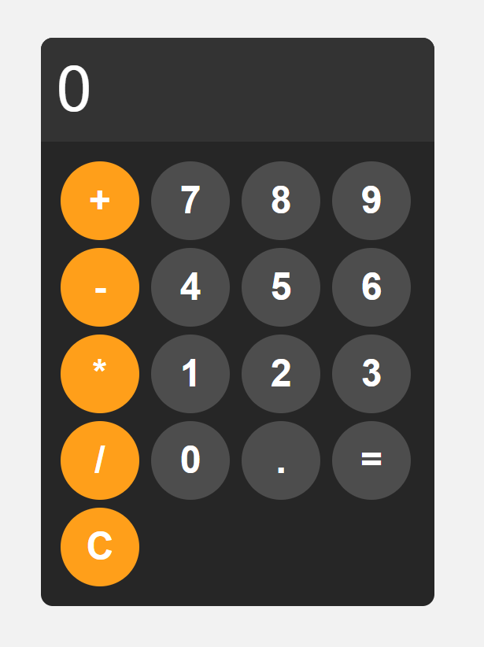

# Basic Calculator

## Preview


A clean, responsive calculator built with vanilla HTML, CSS, and JavaScript.

## Features

- Basic arithmetic operations (addition, subtraction, multiplication, division)
- Decimal support
- Clear display function
- Modern dark theme with orange accent buttons
- Responsive design

## Demo

Simply open `index.html` in your browser to use the calculator.

## Technologies Used

- HTML5
- CSS3 (Flexbox, Grid)
- JavaScript (ES6)

## Usage

1. Clone the repository
   ```bash
   git clone https://github.com/dequaviousthe7th/basic-calculator.git
   ```
2. Open `index.html` in your web browser
3. Start calculating!

## License

This project is open source and available under the [MIT License](LICENSE).
